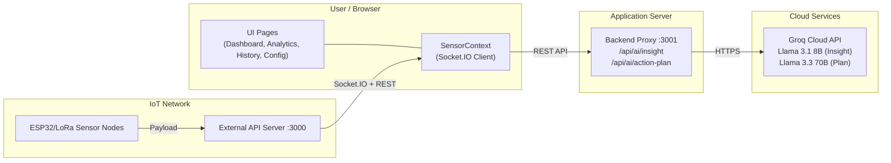
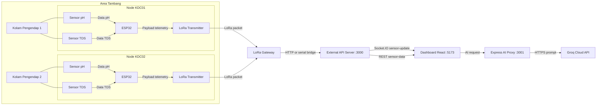
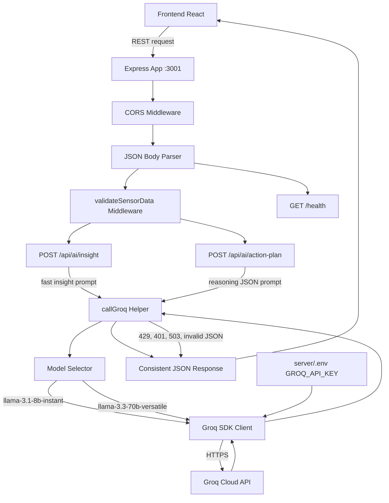
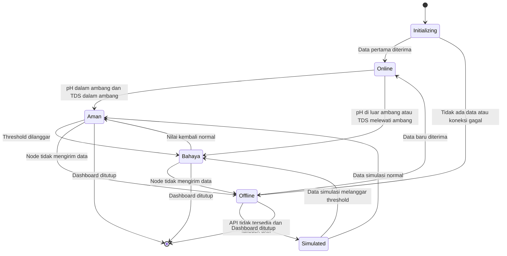
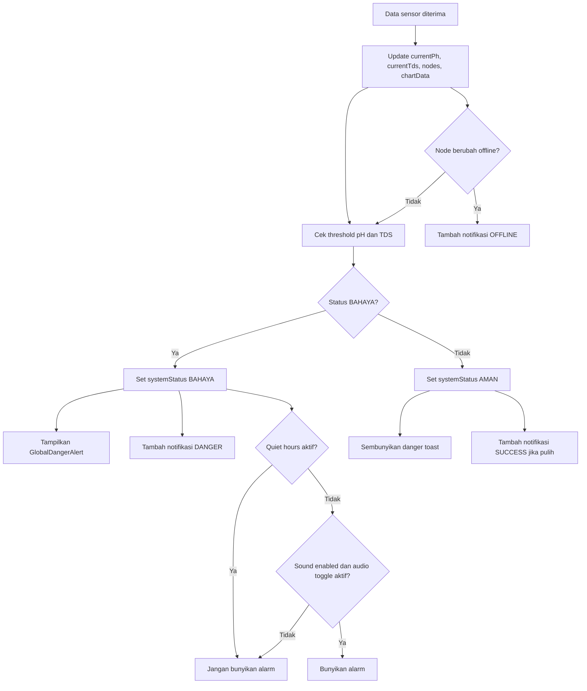
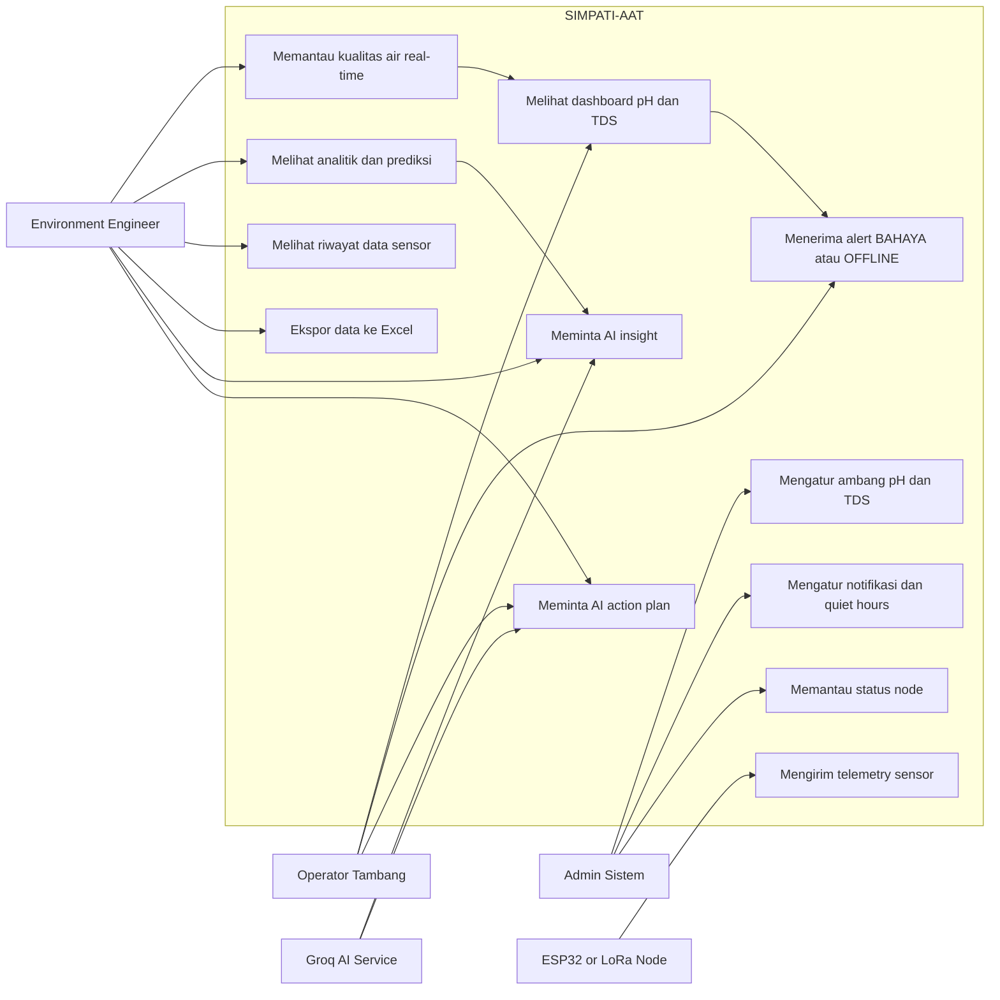
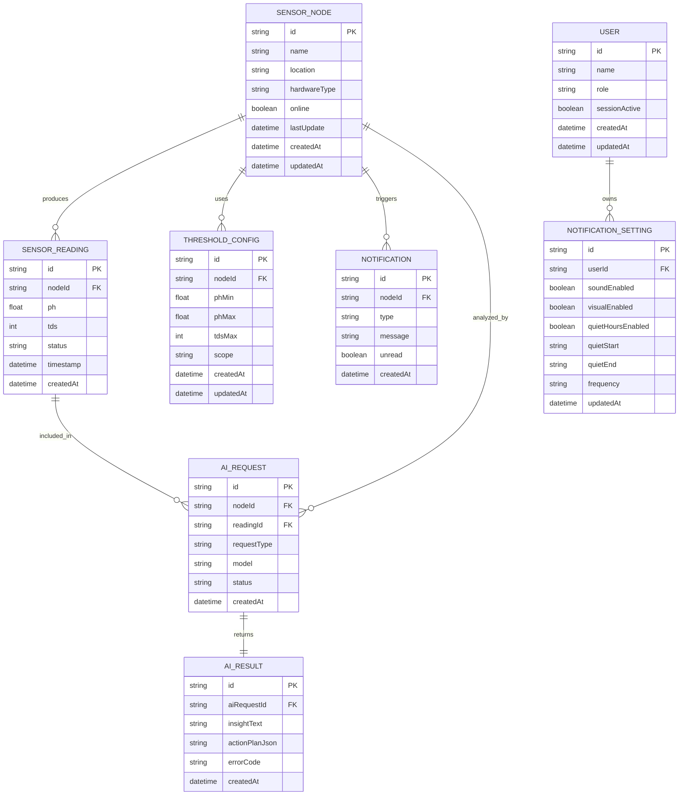
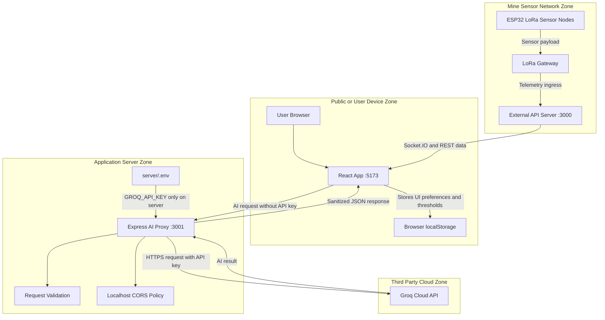
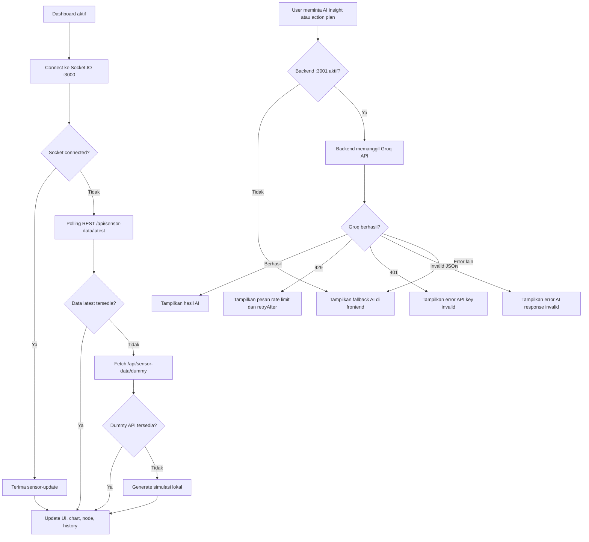

<div align="center">


# SIMPATI-AAT

### Sistem Monitoring, Prediksi, dan Mitigasi Air Asam Tambang

Sistem dashboard berbasis **IoT + AI** untuk mendeteksi, memprediksi, dan memberikan rencana mitigasi Air Asam Tambang (AAT) secara real-time pada operasional tambang batu bara.

<br/>

[](https://react.dev)
[](https://vitejs.dev)
[](https://tailwindcss.com)
[](https://expressjs.com)
[](https://groq.com)
[](https://playwright.dev)

</div>

---

## 📑 Daftar Isi

- [Live Preview Project](#-live-preview-project)
- [Latar Belakang](#-latar-belakang)
- [Fitur Utama](#-fitur-utama)
- [Arsitektur Sistem](#-arsitektur-sistem)
- [Tech Stack](#-tech-stack)
- [Prasyarat](#-prasyarat)
- [Instalasi](#-instalasi)
- [Konfigurasi Environment](#-konfigurasi-environment)
- [Struktur Direktori](#-struktur-direktori)
- [Diagram Arsitektur](#-diagram-arsitektur)
- [Dokumentasi API](#-dokumentasi-api)
- [Pengujian](#-pengujian)
- [NPM Scripts](#-npm-scripts)
- [Kontribusi](#-kontribusi)
- [Dokumentasi Project](#-dokumentasi-project)

---

## 💻 Live Preview Project

🔗 **Live Demo:** [sawit4-kilo.vercel.app](https://sawit4-kilo.vercel.app/)

<p align="center">
  
</p>

---

## 🌊 Latar Belakang

**Air Asam Tambang (AAT)** adalah limbah cair dari aktivitas penambangan batu bara. Saat pH air turun di bawah ambang aman atau kadar TDS melampaui batas, dampaknya sangat serius:

| Dampak | Keterangan |
| :--- | :--- |
| 🏭 **Pencemaran lingkungan** | Mencemari sungai dan tanah di sekitar area tambang |
| 🐟 **Kerusakan ekosistem** | Mengancam kehidupan biota air dan rantai ekosistem perairan |
| 🏘️ **Ancaman kesehatan** | Membahayakan masyarakat yang bergantung pada air tanah |

**SIMPATI-AAT** hadir sebagai solusi yang menggabungkan sensor **IoT (ESP32/LoRa)** dengan kecerdasan buatan **Groq AI** untuk:

1. **Deteksi dini** — Monitoring pH dan TDS secara real-time dari multiple titik sensor.
2. **Prediksi** — Analisis tren dan anomali sebelum masalah terjadi.
3. **Mitigasi** — Action plan yang dihasilkan AI untuk penanganan cepat dan tepat.

---

## ✨ Fitur Utama

<details>
<summary><strong>📡 Monitoring Real-Time</strong></summary>

- Dashboard live yang menampilkan data **pH dan TDS** dari setiap node sensor (ESP32/LoRa).
- Grafik telemetry yang terupdate otomatis via **Socket.IO**.
- Status sistem otomatis: **`AMAN`** atau **`BAHAYA`** berdasarkan ambang batas yang dapat dikonfigurasi.

</details>

<details>
<summary><strong>🤖 Analisis & Prediksi Berbasis AI</strong></summary>

- **AI Insight** — Ringkasan kondisi air 1-2 kalimat oleh model Llama 3.1 (cepat).
- **AI Action Plan** — Rencana mitigasi lengkap dalam format JSON oleh model Llama 3.3 (penalaran tinggi).
- Modul analitik: tren, statistik, deteksi anomali, korelasi, dan peramalan (forecast).

</details>

<details>
<summary><strong>🔌 Manajemen Multi-Node</strong></summary>

- Dukungan beberapa node sensor (KDC01, KDC02, dst.) dengan lokasi berbeda.
- Panel device untuk memantau status koneksi setiap node.
- Detail sidebar per node dengan grafik mini dan riwayat data.

</details>

<details>
<summary><strong>🔔 Notifikasi & Alert</strong></summary>

- Banner peringatan visual saat kondisi BAHAYA terdeteksi.
- Alarm audio (buzzer) yang dapat diaktifkan/dinonaktifkan.
- Log notifikasi real-time (danger, offline, success).
- Pengaturan **quiet hours** untuk menonaktifkan notifikasi pada jam tertentu.

</details>

<details>
<summary><strong>⚙️ Konfigurasi & Riwayat Data</strong></summary>

- Pengaturan ambang batas pH (min/max) dan TDS (maks) melalui UI.
- Semua konfigurasi tersimpan di localStorage browser.
- Tabel log data sensor dengan filter (tanggal, status, node) dan pagination.
- Ekspor data ke Excel dan visualisasi: grafik sedimentasi, circadian range, scatter plot.

</details>

---

## 🏗️ Arsitektur Sistem

Arsitektur SIMPATI-AAT menggunakan pola **decoupled** — frontend dan backend terpisah, berkomunikasi via Socket.IO dan REST API.



### Komponen Utama

| Komponen | Teknologi | Port | Fungsi |
| :--- | :--- | :---: | :--- |
| **Frontend** | React 18 + Vite | `5173` | UI dashboard, visualisasi data |
| **Backend** | Express.js + Groq SDK | `3001` | Proxy AI, validasi request |
| **External API** | Socket.IO + REST | `3000` | Data sensor dari ESP32/LoRa |
| **AI Engine** | Groq Cloud API | — | Insight & Action Plan |

### Alur Kerja AI Groq

Dua model dipilih berdasarkan kompleksitas tugas:

| Aspek | Insight (Fast) | Action Plan (Reasoning) |
| :--- | :---: | :---: |
| **Model** | `llama-3.1-8b-instant` | `llama-3.3-70b-versatile` |
| **Kecepatan** | ⚡ Sangat cepat | 🧠 Analisis mendalam |
| **Max Token** | 200 | 1500 |
| **Output** | Teks 1-2 kalimat | JSON terstruktur |
| **Use Case** | Ringkasan kondisi real-time | Rencana tindakan mitigasi |
| **Temperature** | 0.2 | 0.2 |

<details>
<summary><strong>Contoh Output AI</strong></summary>

**Insight (Fast):**
> Kondisi air di Node KDC01 menunjukkan pH 3.2 (asam) yang jauh di bawah ambang aman 4.5–9.0. TDS 1200 ppm melampaui batas maksimal 800 ppm, indikasi kontaminasi logam berat yang memerlukan penanganan segera.

**Action Plan (Reasoning):**
```json
{
  "masalah": "pH 3.2 dan TDS 1200 ppm di KDC01 melampaui ambang batas AMDAL",
  "data_detail": [
    { "parameter": "pH",  "nilai": "3.2",  "ambang": "4.5–9.0",  "status": "BAHAYA" },
    { "parameter": "TDS", "nilai": "1200", "ambang": "maks 800", "status": "BAHAYA" }
  ],
  "solusi": [
    { "langkah": 1, "tindakan": "Isolasi area terdampak" },
    { "langkah": 2, "tindakan": "Aplikasi kapur tohor (CaO)" },
    { "langkah": 3, "tindakan": "Pemasangan treatment wetland" },
    { "langkah": 4, "tindakan": "Pelaporan ke DLH" }
  ],
  "dampak": "Tanpa penanganan, kontaminasi dapat menyebar ke sungai sekitar."
}
```

</details>

---

## 🛠️ Tech Stack

<details>
<summary><strong>Frontend</strong></summary>

| Teknologi | Versi | Fungsi |
| :--- | :---: | :--- |
| **React** | 18.2 | UI library utama |
| **Vite** | 5.0 | Build tool & dev server |
| **Tailwind CSS** | 4.3 | Utility-first CSS framework |
| **Recharts** | 2.10 | Visualisasi grafik |
| **MUI (Material UI)** | 9.1 | Komponen UI (charts) |
| **Socket.IO Client** | 4.8 | Koneksi real-time ke server sensor |
| **React Hook Form** | 7.78 | Manajemen form |
| **Zod** | 4.4 | Validasi schema |
| **Lucide React** | 1.17 | Ikon |
| **xlsx** | 0.18 | Ekspor data ke Excel |

</details>

<details>
<summary><strong>Backend</strong></summary>

| Teknologi | Versi | Fungsi |
| :--- | :---: | :--- |
| **Express.js** | 4.19 | HTTP server |
| **Groq SDK** | 0.9 | Client untuk Groq AI API |
| **Socket.IO** | — | Real-time communication |
| **CORS** | 2.8 | Cross-origin resource sharing |
| **dotenv** | 16.4 | Environment variables |

</details>

<details>
<summary><strong>Testing</strong></summary>

| Teknologi | Versi | Fungsi |
| :--- | :---: | :--- |
| **Playwright** | 1.61 | End-to-end testing |

</details>

---

## ✅ Prasyarat

Pastikan sistem Anda memiliki:

- **Node.js** `>= 18.0.0` (direkomendasikan: LTS terbaru)
- **npm** `>= 9.0.0`
- **Groq API Key** — Dapatkan gratis di [console.groq.com](https://console.groq.com)
- **Git** (opsional, untuk cloning)

---

## 🚀 Instalasi

### 1. Clone Repository

```bash
git clone <url-repository>
cd "Project Deteksi Air Asam Tambang (1.2)"
```

### 2. Instal Dependencies

```bash
# Frontend (dari root project)
npm install

# Backend
cd server && npm install && cd ..
```

### 3. Konfigurasi Environment

```bash
# Salin file contoh
copy server\.env.example server\.env
```

Buka `server/.env` dan isi dengan konfigurasi Anda:

```env
GROQ_API_KEY=gsk_xxxxxxxxxxxxxxxxxxxxxxxxxxxxxxxx
PORT=3001
```

> 💡 Dapatkan API key Groq secara gratis di [console.groq.com](https://console.groq.com)

### 4. Jalankan Aplikasi

```bash
npm run dev
```

| Service | URL |
| :--- | :--- |
| **Frontend** | `http://localhost:5173` |
| **Backend** | `http://localhost:3001` |

---

## 🔐 Konfigurasi Environment

File environment ditempatkan di `server/.env`:

| Variabel | Wajib | Default | Deskripsi |
| :--- | :---: | :---: | :--- |
| `GROQ_API_KEY` | ✅ | — | API key dari [Groq Cloud](https://console.groq.com) |
| `PORT` | ❌ | `3001` | Port untuk backend proxy server |

> ⚠️ **Penting:** Jangan pernah commit file `.env` ke repository. File ini sudah tercakup dalam `.gitignore`.

---

## 📁 Struktur Direktori

<details>
<summary>Tampilkan struktur lengkap</summary>

```text
Project Deteksi Air Asam Tambang (1.2)/
├── index.html                        # Entry point HTML
├── package.json                      # Dependencies & scripts frontend
├── vite.config.js                    # Konfigurasi Vite
├── tailwind.config.js                # Konfigurasi Tailwind CSS
├── postcss.config.js                 # Konfigurasi PostCSS
├── tsconfig.json                     # Konfigurasi TypeScript
├── playwright.config.js              # Konfigurasi Playwright E2E
│
├── server/                           # Backend Proxy Server
│   ├── index.js                      # Express server + Groq API routes
│   ├── package.json                  # Dependencies backend
│   └── .env                          # Environment variables (tidak di-commit)
│
├── src/                              # Source Code Frontend
│   ├── main.jsx                      # Entry point React
│   ├── App.jsx                       # Root component + routing
│   │
│   ├── components/
│   │   ├── analytics/                # AI Summary, Trend, Stats, Anomaly, Forecast
│   │   ├── config/                   # Device Heartbeat, Threshold Config
│   │   ├── dashboard/                # MetricCard, RealTimeChart, AlertBanner, ActionModal
│   │   ├── device/                   # NodeCard, NodeDetailSidebar
│   │   ├── history/                  # FilterToolbar, LogDataTable, Pagination
│   │   ├── layout/                   # Sidebar, Header, StatusBar, GlobalDangerAlert
│   │   ├── settings/                 # Profile, ESP32, Audio, Threshold, Notification
│   │   └── ui/                       # Badge, Button, Card, FeaturedIcon
│   │
│   ├── context/
│   │   └── SensorContext.jsx         # Global state (sensor, nodes, alerts)
│   │
│   ├── hooks/                        # Custom React Hooks
│   ├── pages/                        # Dashboard, Analytics, History, Device, Config
│   ├── styles/                       # globals.css, theme.css, typography.css
│   └── utils/
│       ├── groq.js                   # Client Groq AI (frontend)
│       └── analytics.js              # Fungsi statistik & analisis
│
├── tests/
│   └── dashboard.spec.js             # E2E Tests (Playwright)
│
└── docs/
    └── design.md                     # Dokumentasi desain
```

</details>

---

## 📊 Diagram Arsitektur

Dokumen ini berisi kumpulan diagram arsitektur untuk project SIMPATI-AAT. Catatan: ERD di bagian akhir adalah model data konseptual yang disarankan jika histori sensor, konfigurasi, notifikasi, dan hasil AI ingin disimpan permanen di database. 

### 1. IoT Network / Sensor Topology Diagram



### 2. Component Diagram Frontend

```mermaid
flowchart TB
  main["main.jsx"]
  provider["SensorProvider"]
  app["App.jsx"]
  sidebar["Sidebar"]
  header["Header"]
  globalAlert["GlobalDangerAlert"]

  main --> provider
  provider --> app
  app --> sidebar
  app --> globalAlert

  subgraph pages["Halaman Aplikasi"]
    dashboard["DashboardPage"]
    analytics["AnalyticsPage"]
    history["HistoryPage"]
    device["DevicePage"]
    config["ConfigPage"]
    settings["SettingsPage"]
  end

  app --> dashboard
  app --> analytics
  app --> history
  app --> device
  app --> config
  app --> settings
  dashboard --> header

  subgraph sensorContext["SensorContext State"]
    liveState["currentPh, currentTds, systemStatus"]
    nodeState["nodes, selectedNode, getNodeStatus"]
    historyState["chartData, historyData"]
    thresholdState["phThresholdMin, phThresholdMax, tdsThreshold"]
    notificationState["notifications, notificationSettings"]
    audioState["audioToggleState, buzzerActive, showDangerToast"]
  end

  provider --> liveState

  subgraph dashboardComponents["Dashboard Components"]
    metricCard["MetricCard"]
    realtimeChart["RealTimeChart"]
    telemetryChart["TelemetryChartContainer"]
    alertBanner["AlertBanner"]
    actionModal["ActionModal"]
    recentLogs["RecentLogsTable"]
  end

  dashboard --> metricCard

  subgraph analyticsComponents["Analytics Components"]
    stats["StatsModule"]
    trend["TrendModule"]
    anomaly["AnomalyModule"]
    forecast["ForecastModule"]
    compare["CompareModule"]
    aiSummary["AISummary"]
  end

  analytics --> stats

  subgraph integration["Integrasi Browser"]
    socketClient["Socket.IO Client"]
    restClient["REST Fetch Client"]
    localStorageClient["localStorage"]
    audioClient["Web Audio API"]
    groqClient["src/utils/groq.js"]
  end

  liveState --> socketClient
  liveState --> restClient
  liveState --> localStorageClient
  liveState --> audioClient
  metricCard --> groqClient
  stats --> groqClient
```



### 3. Component Diagram Backend



### 4. State Diagram Status Sensor



### 5. Alert Workflow Diagram



### 6. Use Case Diagram



### 7. ERD / Data Model Diagram



### 8. Security / Trust Boundary Diagram



### 9. Failure Handling Diagram



---

## 📖 Dokumentasi API

Backend berjalan di `http://localhost:3001`.

### `GET /health`

Memeriksa status server.

```json
{
  "status": "OK",
  "service": "KIDECO Groq AI Proxy",
  "timestamp": "2025-01-15T10:30:00.000Z",
  "models": {
    "reasoning": "llama-3.3-70b-versatile",
    "fast": "llama-3.1-8b-instant"
  }
}
```

### `POST /api/ai/insight`

Mendapatkan insight singkat kondisi air (model cepat).

<details>
<summary>Request & Response</summary>

**Request Body:**
```json
{
  "sensorData": {
    "ph": 3.2,
    "tds": 1200,
    "nodeId": "KDC01",
    "status": "BAHAYA",
    "phMin": 4.5,
    "tdsMax": 800
  }
}
```

**Response:**
```json
{
  "success": true,
  "data": "Kondisi air di KDC01 menunjukkan pH 3.2 (asam) dengan TDS 1200 ppm..."
}
```

</details>

### `POST /api/ai/action-plan`

Mendapatkan rencana tindakan mitigasi lengkap (model penalaran tinggi).

<details>
<summary>Request & Response</summary>

**Request Body:**
```json
{
  "sensorData": {
    "ph": 3.2,
    "tds": 1200,
    "nodeId": "KDC01",
    "status": "BAHAYA",
    "phMin": 4.5,
    "tdsMax": 800,
    "history": [
      { "timestamp": "2025-01-15 10:00:00", "ph": 3.5, "tds": 1100 }
    ]
  }
}
```

**Response:**
```json
{
  "success": true,
  "data": {
    "masalah": "...",
    "data_detail": [...],
    "solusi": [...],
    "dampak": "..."
  }
}
```

</details>

### Error Codes

| HTTP Status | Code | Deskripsi |
| :---: | :--- | :--- |
| `400` | `INVALID_PAYLOAD` | Field `sensorData` tidak ditemukan |
| `400` | `MISSING_FIELDS` | `ph`, `tds`, atau `nodeId` tidak lengkap |
| `401` | `AUTH_INVALID` | API key Groq tidak valid |
| `429` | `RATE_LIMIT_EXCEEDED` | Batas kecepatan Groq API tercapai |
| `500` | `INTERNAL_ERROR` | Kesalahan server internal |
| `502` | `INVALID_AI_RESPONSE` | AI mengembalikan format tidak valid |

---

## 🧪 Pengujian

Proyek ini menggunakan **Playwright** untuk end-to-end testing.

```bash
npm test              # Jalankan semua test
npm run test:ui       # Test dengan Playwright UI (visual)
npm run test:headed   # Test dengan browser terlihat
npm run test:report   # Buka laporan test HTML
```

### Cakupan Test

| Test Case | Deskripsi |
| :---: | :--- |
| **TC-01** | Navigasi dasar dashboard — memuat halaman dan elemen utama |
| **TC-02** | Kondisi BAHAYA — banner alert muncul saat threshold terlampaui |
| **TC-03** | Navigasi antar halaman (sidebar) |
| **TC-04** | Interaksi komponen (modal, filter, pagination) |
| **TC-05** | Responsivitas layout |

---

## 📦 NPM Scripts

| Perintah | Fungsi |
| :--- | :--- |
| `npm run dev` | Jalankan frontend + backend secara bersamaan |
| `npm run dev:client` | Jalankan hanya frontend (Vite) |
| `npm run dev:server` | Jalankan hanya backend (Express) |
| `npm run build` | Build frontend untuk produksi |
| `npm run preview` | Preview build produksi |
| `npm test` | Jalankan semua E2E test |
| `npm run test:ui` | Jalankan test dengan Playwright UI |
| `npm run test:headed` | Jalankan test dengan browser terlihat |
| `npm run test:report` | Buka laporan test HTML |
| `npm run lint` | Jalankan ESLint |

---

## 🤝 Kontribusi

1. Fork repository ini
2. Buat branch baru: `git checkout -b fitur/nama-fitur`
3. Commit perubahan: `git commit -m "feat: tambahkan fitur X"`
4. Push ke branch: `git push origin fitur/nama-fitur`
5. Buat Pull Request

### Commit Convention

Proyek ini mengikuti [Conventional Commits](https://www.conventionalcommits.org/):

| Prefix | Keterangan |
| :--- | :--- |
| `feat:` | Fitur baru |
| `fix:` | Perbaikan bug |
| `docs:` | Perubahan dokumentasi |
| `style:` | Perubahan formatting (tidak mengubah logika) |
| `refactor:` | Refactoring kode |
| `test:` | Penambahan atau perbaikan test |
| `chore:` | Maintenance tasks |

---

## 📷 Dokumentasi Project

| Halaman Dashboard | Halaman History & Laporan |
| :---: | :---: |
|  |  |
| **Halaman Device** | **Halaman Analis** |
|  |  |
---

## 📄 Lisensi

Proyek ini dikembangkan untuk keperluan lomba/akademik. Silakan hubungi tim pengembang untuk informasi lisensi lebih lanjut.

---

<div align="center">

**SIMPATI-AAT** — Monitoring Air Asam Tambang yang Cerdas dan Terpadu

Dibangun dengan Tim Sawit4Kilo

</div>
